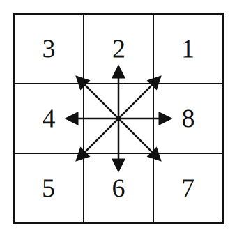
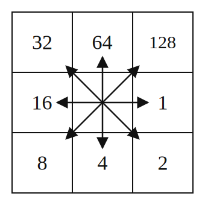
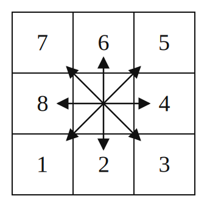

# Grid operations

The grid operations module provides functions for processing and transforming gridded raster data, including resolution decimation and flow direction conversions.

## Overview

Grid operations are essential for:

- **Multi-resolution modeling**: Coarsen high-resolution DEMs, flow direction, and accumulation grids
- **Flow direction processing**: Handle different flow direction notation systems (Grass `r.watershed` vs ArcGIS)
- **Preprocessing**: Prepare gridded data for hydrological modeling

All functions handle NaN values.

## Flow direction notations

MOBIDICpy supports two flow direction notation systems. All diagrams below are
shown in geographic orientation (north up).

### Grass notation (1-8)

Standard GRASS `r.watershed` convention: codes 1-8 placed counter-clockwise starting
from NE. 
To use this notation, the option `raster_settings.flow_dir_type` in the YAML configuration file must be set to "Grass".

{ .notation-diagram }

### Arc notation (powers of 2)

Standard ESRI ArcGIS convention: powers of 2 placed clockwise starting from E. 
To use this notation, the option `raster_settings.flow_dir_type` in the YAML configuration file must be set to "Arc".

{ .notation-diagram }

### MOBIDIC notation (1-8)

The flow directions, either in Grass or Arc notation, are then internally converted to
MOBIDIC's D8 encoding as follows:

{ .notation-diagram }

## Technical details

### Degradation algorithm

1. Divides the input grid into blocks of size `factor × factor`
2. For regular rasters: computes mean of valid cells in each block
3. For flow direction: finds the cell with maximum flow accumulation in each block, determines the dominant flow direction
4. Applies `min_valid_fraction` threshold to avoid blocks with too few valid cells

### Flow direction degradation

The algorithm preserves drainage patterns by:

1. Finding the fine cell with maximum flow accumulation in each coarse block
2. Determining which coarse neighbor the drainage flows to
3. Assigning the appropriate flow direction code
4. Normalizing flow accumulation by `factor × factor` to maintain consistent scaling

## Notes

- All functions return new arrays and transforms without modifying inputs
- NaN values are properly propagated and excluded from calculations
- Flow direction values must be in the valid range for the specified notation
- Invalid flow direction values (e.g., not in Grass 1-8 or Arc powers-of-2) are converted to NaN


## Functions

### Resolution decimation

::: mobidic.preprocessing.grid_operations.decimate_raster

::: mobidic.preprocessing.grid_operations.decimate_flow_direction

### Flow direction conversion

::: mobidic.preprocessing.grid_operations.convert_to_mobidic_notation

## Examples

### Coarsening a raster

```python
from mobidic import grid_to_matrix, decimate_raster
import numpy as np

# Read high-resolution DTM (e.g., 10m)
dtm = grid_to_matrix("dtm_10m.tif")

# Degrade to 50m resolution (factor = 5)
dtm_decimated = decimate_raster(
    data=dtm['data'],
    factor=5,
    min_valid_fraction=0.125  # Require at least 1/8 valid cells
)

print(f"Original shape: {dtm['data'].shape}")
print(f"Decimated shape: {dtm_decimated.shape}")
print(f"Original cellsize: {dtm['cellsize']} m")
print(f"New cellsize: {dtm['cellsize'] * 5} m")
```

### Coarsening flow direction

```python
from mobidic import grid_to_matrix, decimate_flow_direction

# Read flow direction and accumulation grids
flow_dir_data = grid_to_matrix("flow_direction.tif")
flow_acc_data = grid_to_matrix("flow_accumulation.tif")

# Degrade both grids together
flow_dir_coarse, flow_acc_coarse = decimate_flow_direction(
    flow_dir=flow_dir_data['data'],
    flow_acc=flow_acc_data['data'],
    factor=5,
    min_valid_fraction=0.5
)

print(f"Original shape: {flow_dir_data['data'].shape}")
print(f"Decimated shape: {flow_dir_coarse.shape}")
```

### Converting flow direction notation

```python
from mobidic import grid_to_matrix, convert_to_mobidic_notation

# Read flow direction in Grass notation (1-8)
flow_dir_grass = grid_to_matrix("flow_dir_grass.tif")

# Convert to MOBIDIC notation (used internally by the model)
flow_dir_mobidic = convert_to_mobidic_notation(
    flow_dir=flow_dir_grass['data'],
    from_notation="Grass"
)

# Or convert from Arc notation directly
flow_dir_arc = grid_to_matrix("flow_dir_arc.tif")
flow_dir_mobidic = convert_to_mobidic_notation(
    flow_dir=flow_dir_arc['data'],
    from_notation="Arc"
)
```
